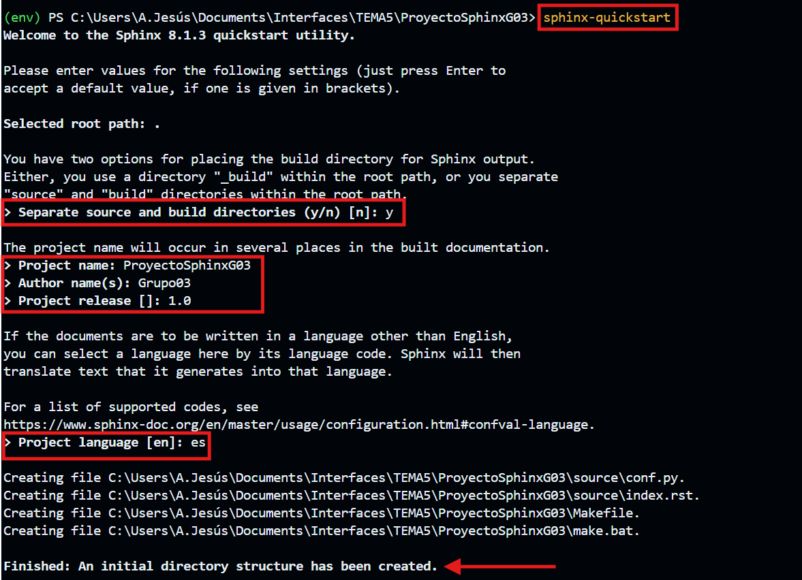

# Creación inicial del proyecto con Sphinx

Sphinx es una herramienta potente para generar documentación técnica. Aquí, detallaremos los pasos para configurar el proyecto inicial.

## Activación del entorno virtual

Para que funcionen los comandos que aparecerán mas adelante, deberemos activar nuestro entorno virtual, para ello, introduciremos el siguiente comando donde se encuentre nuestro entorno virtual:

```bash
.\(nombre_entorno)\Scripts\activate
```

---

## Creación del proyecto inicial con Sphinx

### Paso 1: Inicializar proyecto

Navega a la carpeta raíz de tu proyecto  y ejecuta el siguiente comando:

```bash
sphinx-quickstart
```

Esto lo que hará es iniciar un asistente interactivo que configurará el proyecto inicial. A continuación, te mostraremos las preguntas típicas que aparecerán y cómo responderlas.

### Paso 2: Preguntas en la creación

**Separate source and build directories (y/n)**:
Responde 'y' para mantener una estructura más organizada con carpetas separadas para los archivos fuente (source/) y los archivos generados (_build/).

**Project name**:
Escribe el nombre de tu proyecto, por ejemplo:

```bash
ProyectoSphinxG03
```

**Author name**:
Escribe tu nombre como autor, por ejemplo:

```bash
Grupo 03
```
**Project release**:
Indica la versión inicial de tu proyecto, como:

```bash
1.0
```


**Do you want to use a Makefile? (y/n)**:
Responde 'y' para facilitar la generación de documentación en sistemas Linux/macOS.

**Do you want to use a Windows command file? (y/n)**:
Responde 'y' si estás trabajando en Windows.

**Language**:
Especifica el idioma de la documentación, en este caso:

```bash
es
```

Ejemplo:

